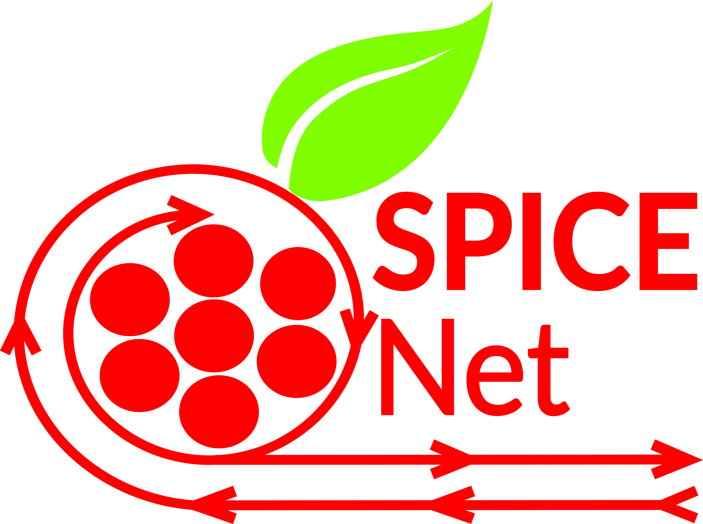

# SPICEnet in Python
SPICEnet is an artificial neural network that is capable of identifying the mathematical relationship between two values. This library provides a single core implementation for quick usage.
For more information about the network look up the pdf in the docs folder.

## Install
```pip install spicenet```

If you want to use the plotting subpackage use this command instead:\
```pip install spicenet[plotting]```

## How to use
Please take a look at the [tutorial notebook](/notebooks/spice_net_tutorial.ipynb).


## Notebooks
The Notebooks you will find in this repository, are examples on how to use this library.

- [tests](/notebooks/tests.ipynb): This notebook is only for test cases, it might not be running. 
- [solar panels](/notebooks/solar_panel_example.ipynb): This notebook shows you how to calculate the voltage of a solar panel by the lux level of the environment.
- [tutorial](/notebooks/spice_net_tutorial.ipynb): Follow this guid on how to use this library

## Bachelor Thesis Notebooks
- [test_nir](/notebooks/spice_net_tutorial_test_nir.ipynb): This notebook tests exporting from SPICEnet in the original implementation to NIR and then reimporting it back to the original implementation.
- [test_nir_export_sinabs_reimport](/notebooks/spice_net_tutorial_test_nir_export_sinabs_reimport.ipynb): This notebook does similar as the last one, but additionally exports from the original implementation to NIR, then to SINABS, then to NIR again and then to the original implementation. These tests confirm that our parameters remain unchanged both ways.
- [sinabs_transfer](/notebooks/sinabs_transfer.ipynb): This notebook tests the SINABS implementation of the SPICEnet based on the newly trained SOM neuron SNN. It included various analysis, transfer tests and evaluation comparisions. It also tries training directly in the new implementation.

## Other Bachelor Notes
NIR as well as SINABS have been added as submodules. These submodules point to the latest commit of the fork created during the bachelor thesis and includes the changes made to these frameworks to work with NIR exchange for SPICEnet. We also add additional links to these forks here:

 - [NIR fork](https://github.com/lmitlaender/NIR/tree/main)
 - [SINABS fork](https://github.com/lmitlaender/sinabs/tree/develop)

Additionally, we add another submodule "Bachelor_SPICEnet_SOM_Neuron_SNN". This submodule points to the repository for the ANN-to-SNN work as well as the further improvements performed at the end of the work. The exploration into direct training is also found here. It has its own requirements and is only linked here to gather all work in this branch. Additionally here the link directly to the repository: [Bachelor_SPICEnet_SOM_Neuron_SNN](https://github.com/lmitlaender/Bachelor_SPICEnet_SOM_Neuron_SNN/tree/main)